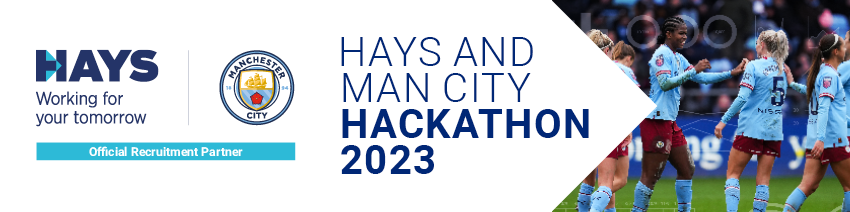

# Event brief

> Delivering actionable match insights to coaching teams

## What you'll need to do

Football is a highly emotive and intense sport, not only for fans and players, but for coaching teams also. But highly emotive and intense situations aren’t usually conducive to good decision-making processes and can therefore lead to erroneous decisions.

This is where adding objectivity to the process of reviewing team and individual player performance is important to ensuring optimal decisions are made, whether they’re related to in-game tactical changes, player substitutions or the interventions and practices that are put in place throughout the training week. This objectivity can come in many shapes and sizes, but two of the most readily available data sets for professional teams are event & tracking data.

Event data provides all the details about what on-ball action is being made, where on the pitch and by whom (e.g. a header by Alex Greenwood on the edge of the 6-yard box).

Tracking data provides the x/y location of all the players on the pitch and the ball at every moment throughout the game.

The combination of these 2 data sets provides a rich form of objective information regarding what is happening on the pitch. But information is only the first step on the path to positively impacting decisions.

To truly have a meaningful impact on the decision-making process, this information needs to be transformed into actionable insight.

This is why we want you to develop an App / Tool that delivers timely actionable match feedback in an easily-understood and digestible manner, so that it can inform the coaching team’s decisions and ultimately have a positive impact on overall team and/or individual player performances - whether this is before, during, or after the game.

## The Data

All the data you need access to has been provided by MCFC partners Second Spectrum and StatsBomb. In the link below there are supporting documents, and data from 6 WSL games from both sets of partners, giving you full access to both event & tracking data across the games.

[Man City Hack Data](https://drive.google.com/drive/folders/1cGrTtDJXq5otTa-mh2sB4ApTdjKMcwk7)

## What you'll need to submit

🎥 Video pitch - you should upload a video pitch, going through the details of your solution, why you’ve done what you’ve done, why you think it would be more successful than current methods, and the viability (videos should be no longer than 5 minutes)

💻 GitHub link - if you're using GitHub, make sure to link your repo to your project so we can take a look at what you did

🚀 Working app/prototype - as well as the repo, you should include a link to your solution so that we can have a look and try it out for ourselves. (if you're linking to a Figma prototype, make sure the link is public!)

## What we're looking for

Pitch - you’ll be judged on the idea that you come up with to solve the problem. Even if you don’t manage to get as much actioned as you’d hoped over the next few weeks, you may still have the best idea so make sure to submit either way!

Viability - is the solution viable? Have you considered the different stakeholders, the core issues outlined on the brief, and come up with something that could not only work, but actually be used by the coaches?

Idea - you’ll be judged on the idea that you come up with to solve the problem. Even if you don’t manage to get as much actioned as you’d hoped over the next few weeks, you may still have the best solution

Execution - last but not least, we’ll be taking a look at what you managed to achieve in the timeframe, so make sure to link any repos, and upload any links to prototypes/websites/apps etc. so we can test them out as mentioned

## Considerations

- The length of half time and how long coaches will have to look at & deliver the feedback if delivering insights during a game for them to use
- The background of the coaches (i.e possibly no technical background so will need the solution to be easy to use and analyse)
- The context of the match (i.e. will the feedback be displayed differently depending on the score)
- How could this work with other data sources available to the coaches?